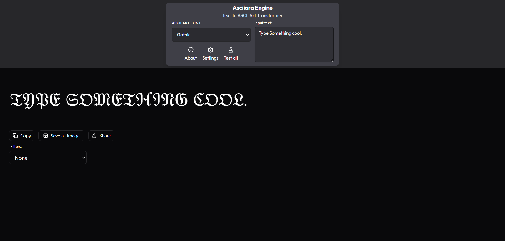

# <a href="https://asciiara.vercel.app" target="_blank">Asciiara - Text to hand made ASCII Fonts</a>

**Asciiara** is a modern, interactive web application that transforms standard text into stunning (Hand made) ASCII Fonts. Browse through 22+ custom hand-crafted fonts, test them all in a responsive gallery, and export your creations directly to high-quality PNGs.

Built for **creativity, speed, and precision** — all running entirely in the browser.

<p align="left">
  <a href="./LICENSE">
    
  </a>
  
  
  <a href="https://github.com/byllzz">
    
  </a>
  <a href="https://github.com/byllzz/asciiara/releases">
     
  </a>
</p>
<br />

[](https://asciiara.vercel.app)



⭐ **Star the repo if you like it — it really helps!**

---

#  Features

<p align="left">
✔️ 22+ Custom Hand-Crafted ASCII & Unicode Fonts<br>
✔️ Instant Text-to-ASCII Transformation<br>
✔️ High-Fidelity PNG Export with Loading States<br>
✔️ 'Test All' Gallery View for Quick Font Comparisons<br>
✔️ Persistent Local Storage (Remembers settings & text drafts)<br>
✔️ Light & Dark Theme Support with seamless UI transitions<br>
✔️ 1-Click Copy to Clipboard & Native Browser Sharing<br>
✔️ Responsive Layout (Keyboard, Mouse & Touch friendly)<br>
✔️ No Accounts, No Tracking, No Backend Required<br>
✔️ Built with React & Tailwind CSS
</p>

---

##  How It Works

- Uses a **custom font mapping engine** (O(1) lookups) for instantaneous text transformation without relying on heavy external libraries.
- Renders complex multi-line string matrices perfectly using responsive whitespace handling.
- State is managed and persisted globally via **custom LocalStorage hooks**, ensuring you never lose your work on refresh.
- Image generation is handled dynamically, injecting theme-aware backgrounds before capturing the DOM node for perfect PNG exports.
- All processing happens **100% client-side**, ensuring maximum privacy and zero network latency.

---

##  Installation & Setup

### Requirements
- Node.js installed on your machine
- A modern Web Browser (Chrome / Edge / Firefox)
- *Note: No API keys are required as Asciiara runs entirely locally!*

### Clone the Repository
```bash
git clone https://github.com/byllzz/asciiara.git
cd asciiara
```

# License 📄

This project is licensed under the MIT License - see the [LICENSE.md](./LICENSE) file for details.

# Feedback 

Reach out at **bilalmlkdev@gmail.com**. If you like this project, please ⭐ star the repo - it motivates future updates!
